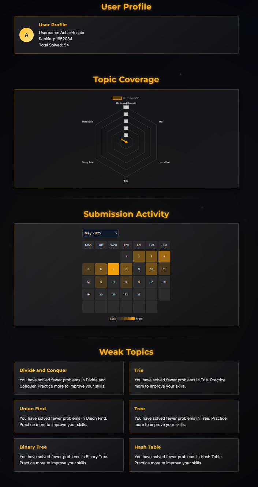

# 🚀 LeetCode Weak Topic Analyzer

## 📘 Overview

The **LeetCode Weak Topic Analyzer** is a web application built to help LeetCode users:

* Identify weak programming topics
* Track submission activity
* Receive personalized problem and resource recommendations

✨ With a modern tech stack and sleek UI, it features parallax particle effects, a radar chart, and an interactive submission calendar to visualize your coding journey!

---

## 🧩 Features

✅ **User Profile** – Displays your LeetCode username, global ranking, and total problems solved
📊 **Topic Coverage** – Radar chart visualization of your strengths and weaknesses
📆 **Submission Calendar** – Tracks your daily activity with tooltips and month selector
📉 **Weak Topics** – Highlights topics with <30% proficiency
🧠 **Recommended Problems** – Suggests targeted LeetCode problems for improvement
📚 **Learning Resources** – Curated articles and videos to strengthen weak areas
🌌 **Visual Effects** – Parallax particles and smooth transitions for a beautiful experience

---

## 📸 Screenshots

### 🏠 Home Page


### 🔍 Searching State



---

## 🛠 Tech Stack

### 💻 Frontend

* HTML, CSS (Tailwind CSS), JavaScript
* Chart.js for radar chart
* Custom animations and parallax effects

### 🔧 Backend

* Node.js with Express.js
* GraphQL API integration with `node-fetch`

### 📦 Dependencies

* `express` for server setup
* `node-fetch` for GraphQL requests
* Tailwind CSS & Chart.js via CDN

---

## 🚧 Setup Instructions

### 🔑 Prerequisites

* Node.js (v14 or higher)
* npm (Node Package Manager)
* A modern browser (Chrome, Firefox, etc.)

### 📥 Installation Steps

1. **Clone the Repository**

   ```
   git clone <repository-url>
   cd LeetCodeProblemSuggestor
   ```

2. **Install Dependencies**

   ```
   npm install
   ```

3. **Run the Application**

   ```
   node server.js
   ```

   The server will start on: [http://localhost:3000](http://localhost:3000)

4. **Use the App**

   * Open your browser and go to `http://localhost:3000`
   * Enter a valid LeetCode username
   * Start analyzing your coding profile! 🚀

---

## 🧪 Usage

👤 Enter your LeetCode username →
📈 View profile, topic radar, and activity calendar →
📉 Discover weak topics →
🧩 Get tailored problems & resources →
🔍 Dive deeper into specific months using the submission calendar!

---

## 📝 Notes

⚠️ LeetCode API has rate limits – backend handles retries on 429 errors
🖼 Make sure `public/screenshots/` contains:

* `HomePage.png`
* `Searching.png`

---

## ⚠️ Limitations

* Dependent on LeetCode's GraphQL API, which may change or throttle
* Fixed topic problem count (100) might not match real counts
* Submission calendar only covers activity from **May 23, 2024 → May 23, 2025**

---

## 🔮 Future Improvements

🚀 Caching API responses to reduce request load
📊 Smarter topic coverage using live problem counts
📉 Add difficulty breakdown and success rate analytics

---

## 🙌 Acknowledgments

❤️ Built with love by LeetCode Enthusiasts
🔌 Powered by LeetCode's GraphQL API
🎨 Styled using Tailwind CSS & Chart.js

---

